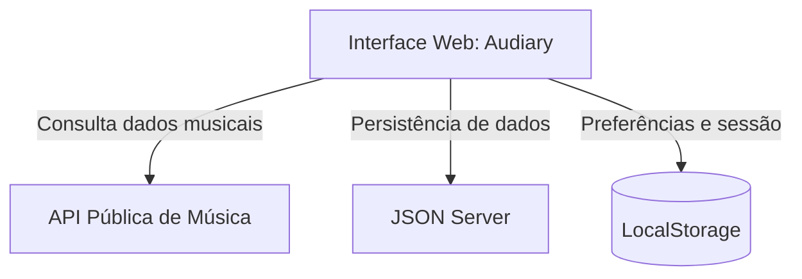

# 🎧 Audiary

### *Keep track of what you hear*

Uma plataforma de catalogação, descoberta e registro de experiências musicais — inspirada no Letterboxd, mas para os álbuns que você ouve.


---

## 📖 Sobre o projeto

Enquanto os serviços de streaming são feitos para **tocar** música, o **Audiary** é feito para você **lembrar** dela.

O objetivo é funcionar como um diário musical digital: um espaço onde você registra os álbuns que ouviu, atribui notas, escreve resenhas e constrói, aos poucos, um histórico da sua própria trajetória musical.

## ✨ Funcionalidades

- 🔍 **Busca de artistas e álbuns** através de uma API pública de música
- 🎵 **Registro de audição** — marque álbuns como ouvidos, com data
- ⭐ **Avaliações** de 1 a 5 estrelas
- 📝 **Resenhas** — escreva, edite e exclua suas impressões sobre cada álbum
- 📚 **Biblioteca pessoal** com os álbuns que você já ouviu
- ❤️ **Favoritos** para acessar rapidamente o que você mais gosta
- 📌 **Listenlist** — sua lista de desejos musicais
- 👤 **Perfil** com todo o seu histórico, avaliações e resenhas
- 🎚️ Filtros por **gênero** e **ano de lançamento**

## 🛠️ Tecnologias

| Camada | Tecnologias |
|---|---|
| **Front-end** | HTML5, CSS3, Sass/SCSS, Bootstrap, JavaScript, jQuery |
| **Persistência de dados** | JSON Server (API fake) + LocalStorage |
| **Dados musicais** | API pública de música |
| **Ferramentas** | Node.js, NPM, ESLint, Prettier, Git/GitHub |

## 🏗️ Arquitetura



- **Interface Web** — apresentação das páginas e interação com o usuário
- **API Pública de Música** — artistas, álbuns, capas, gêneros e faixas
- **JSON Server** — simula o backend, persistindo dados de audição, avaliações, resenhas e listas
- **LocalStorage** — preferências de interface e dados de sessão

## 🗂️ Modelo de dados (resumo)

- **Usuário** → possui registros de audição, resenhas e lista de desejos
- **Álbum** → recebe registros de audição, resenhas e pode estar na lista de desejos
- **Registro de Audição** → data, nota e status de favorito
- **Resenha** → texto e data de criação
- **Lista de Desejos** → álbuns a ouvir no futuro

## 🚀 Como rodar o projeto

```bash
# Clone o repositório
git clone https://github.com/seu-usuario/audiary.git

# Acesse a pasta do projeto
cd audiary

# Instale as dependências
npm install

# Inicie a API fake (JSON Server)
npm run server

# Inicie a aplicação
npm start
```

> Ajuste os comandos acima conforme os scripts definidos no seu `package.json`.

## 📋 Roadmap

**MVP**
- [x] Busca de artistas e álbuns
- [x] Visualização de informações de álbuns
- [x] Registro de álbuns ouvidos
- [x] Sistema de avaliação (1–5 estrelas)
- [x] Resenhas
- [x] Biblioteca pessoal
- [x] Perfil do usuário

**Próximos passos**
- [ ] Sistema de favoritos
- [ ] Listenlist
- [ ] Filtros por gênero e ano

**Futuro**
- [ ] Ordenação do histórico (data, nota, título)
- [ ] Estatísticas pessoais de audição
- [ ] Sugestões de álbuns por gênero favorito

## 📖 Checklist | Indicadores de Desempenho (ID)

Checklist dos Resultados de Aprendizagem (RA) da Matriz por Competências, conforme exigido no template da disciplina.

### RA1 - Utilizar Frameworks CSS para estilização de elementos HTML e criação de layouts responsivos

- [ ] **ID 01** - Prototipa interfaces adaptáveis para no mínimo os tamanhos de tela mobile e desktop, usando ferramentas de design tradicionais (Figma, Quant UX ou Sketch) ou IA (Stitch).
- [ ] **ID 02** - Implementa layout responsivo com Framework CSS (Bootstrap, Materialize) usando Flexbox ou Grid do próprio framework.
- [ ] **ID 03** - Implementa layout responsivo com CSS puro, usando Flexbox ou Grid Layout.
- [ ] **ID 04** - Utiliza componentes prontos de um Framework CSS (ex.: card, button) e componentes JavaScript do framework (ex.: modal, carousel).
- [ ] **ID 05** - Cria layout fluido usando unidades relativas (vw, vh, %, em, rem) no lugar de unidades fixas (px).
- [ ] **ID 06** - Aplica um Design System consistente (cores, tipografia, padrões de componentes) em toda a aplicação.
- [ ] **ID 07** - Utiliza Sass (SCSS) com ou sem framework, aplicando variáveis, mixins e funções para modularizar o código.
- [ ] **ID 08** - Aplica tipografia responsiva (media queries mobile first) ou tipografia fluida (função `clamp()` + unidades relativas).
- [ ] **ID 09** - Aplica técnicas de responsividade de imagens usando CSS (`object-fit`, containers com unidades relativas).
- [ ] **ID 10** - Otimiza imagens usando formatos modernos (WebP) e carregamento adaptativo (`srcset`, `picture`, ou parâmetros do Cloudinary).

### RA2 - Realizar tratamento de formulários e aplicar validações customizadas no lado cliente

- [ ] **ID 11** - Implementa validação HTML nativa (campos obrigatórios, tipos, limites de caracteres) com mensagens de erro/sucesso no lado cliente.
- [ ] **ID 12** - Aplica expressões regulares (REGEX) para validações customizadas (e-mail, telefone, datas, etc.).
- [ ] **ID 13** - Utiliza elementos de seleção em formulários (checkbox, radio, select) para coleta de dados.
- [ ] **ID 14** - Implementa leitura e escrita no Web Storage (localStorage/sessionStorage) para persistir dados localmente.

### RA3 - Aplicar ferramentas para otimização do processo de desenvolvimento web

- [ ] **ID 15** - Configura ambiente com Node.js e NPM para gerenciamento de pacotes e dependências.
- [ ] **ID 16** - Utiliza boas práticas de versionamento no Git/GitHub (branch main ou branches específicos, uso de `.gitignore`).
- [ ] **ID 17** - Mantém um README.md padronizado, conforme template da disciplina, com checklist preenchido.
- [ ] **ID 18** - Organiza arquivos do projeto de forma modular, seguindo padrão de exemplo fornecido.
- [ ] **ID 19** - Configura linters e formatadores (ESLint, Prettier) para manter qualidade e padronização do código.

### RA4 - Aplicar bibliotecas de funções e componentes em JavaScript para aprimorar a interatividade de páginas web

- [ ] **ID 20** - Utiliza jQuery para manipulação do DOM e interatividade (eventos, animações, manipulação de elementos).
- [ ] **ID 21** - Integra e configura um plugin jQuery relevante (ex.: jQuery Mask Plugin) ou outra biblioteca de funções.

### RA5 - Efetuar requisições assíncronas para uma API fake e APIs públicas, permitindo a obtenção e manipulação de dados dinamicamente

- [ ] **ID 22** - Realiza requisições assíncronas para uma API fake (ex.: JSON Server) para persistir dados de um formulário.
- [ ] **ID 23** - Realiza requisições assíncronas para uma API fake para exibir dados na página.
- [ ] **ID 24** - Realiza requisições assíncronas para APIs públicas reais (OpenWeather, ViaCEP etc.), exibindo os dados e tratando erros.

## 🙅 Fora do escopo (por enquanto)

- Reprodução de áudio dentro da aplicação
- Importação automática de histórico (Spotify, Apple Music, etc.)
- Sistema de seguidores e interação social

## 👤 Autor

**Leonardo Nicolau Skorobohatei**

---

<p align="center">Feito com 🎶 para quem leva a música a sério.</p>
