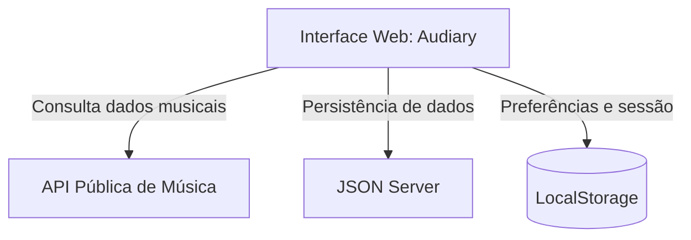
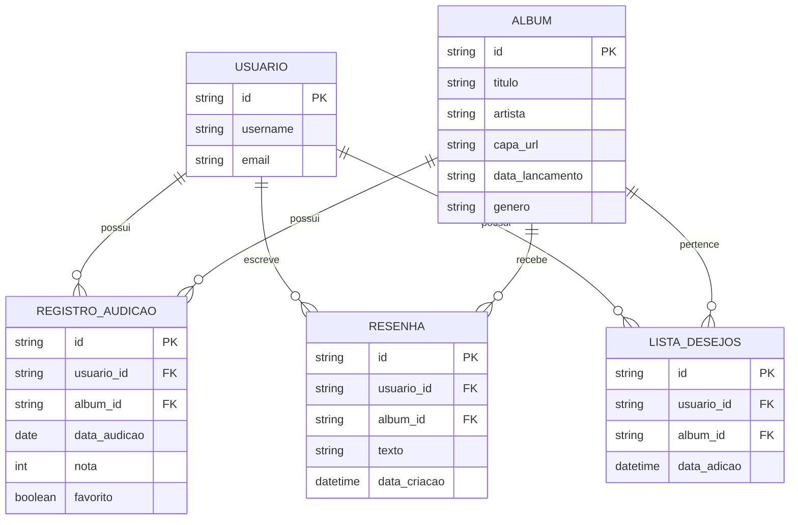

# Arquitetura de Software: Audiary

## 1. Contexto Técnico

O Audiary será desenvolvido como uma aplicação web responsiva voltada à catalogação e ao registro de experiências musicais.

A aplicação utilizará tecnologias de desenvolvimento front-end, uma API pública para obtenção de informações musicais e uma API fake para simular a persistência dos dados gerados pelos usuários.

O armazenamento local do navegador também será utilizado para manter determinadas preferências e informações da sessão do usuário.

## 2. Arquitetura do Sistema

### Componentes principais

- **Interface Web:** responsável pela apresentação das páginas e interação com o usuário.
- **API Pública de Música:** fornece informações como artistas, álbuns, capas, gêneros e faixas.
- **JSON Server:** simula uma API de backend para persistência dos dados do usuário.
- **LocalStorage:** armazena informações locais, como preferências e dados de sessão.

## 3. Pilha Tecnológica

- **HTML5:** estrutura das páginas.
- **CSS3:** estilização e layouts personalizados.
- **Bootstrap:** framework CSS utilizado para componentes e layouts responsivos.
- **Sass/SCSS:** organização e modularização dos estilos.
- **JavaScript:** lógica e interatividade da aplicação.
- **jQuery:** manipulação do DOM e implementação de interações.
- **Node.js e NPM:** gerenciamento de dependências e ferramentas do projeto.
- **JSON Server:** API fake para persistência e consulta dos dados.
- **ESLint:** análise estática e padronização do código JavaScript.
- **Prettier:** formatação automática do código.
- **Git/GitHub:** versionamento e gerenciamento do código-fonte.
- **API Pública de Música:** fornecimento de informações sobre artistas e álbuns.

## 4. Modelo de Dados

O Audiary utilizará uma estrutura de dados baseada nas principais entidades necessárias para o funcionamento da aplicação.

### Descrição das Entidades

**USUARIO**
Representa os usuários da aplicação e armazena suas informações básicas de identificação.

**ALBUM**
Representa os álbuns catalogados pela aplicação. Os dados musicais poderão ser obtidos inicialmente por meio da API pública.

**REGISTRO_AUDICAO**
Representa o registro de um álbum ouvido pelo usuário, armazenando a data da audição, a avaliação e a informação de favorito.

**RESENHA**
Representa uma avaliação textual realizada pelo usuário sobre um álbum.

**LISTA_DESEJOS**
Representa os álbuns que o usuário deseja ouvir futuramente.

## 5. Persistência de Dados

Os dados serão divididos entre diferentes mecanismos de armazenamento de acordo com sua finalidade.

### API Fake

O JSON Server será responsável pela persistência de dados relacionados à atividade do usuário, como:

- Registros de audição;
- Avaliações;
- Resenhas;
- Lista de desejos;
- Dados básicos de usuários.

### LocalStorage

O `localStorage` será utilizado para armazenar informações que precisam permanecer disponíveis no navegador, como preferências da interface e informações relacionadas à sessão.

### API Pública

Informações como nome do álbum, artista, capa, gênero, data de lançamento e faixas serão obtidas dinamicamente por meio de uma API pública de música.

## 6. Fluxo de Integração com a API Pública

1. O usuário pesquisa um artista ou álbum na aplicação.
2. O front-end realiza uma requisição assíncrona para a API pública.
3. Os dados retornados são processados pela aplicação.
4. Os resultados são exibidos em cards na interface.
5. Ao selecionar um álbum, seus dados são utilizados para preencher a página de detalhes.
6. O usuário pode registrar o álbum como ouvido, avaliá-lo, escrever uma resenha ou adicioná-lo à lista de desejos.
7. Os dados gerados pelo usuário são enviados para a API fake.
8. A aplicação trata possíveis erros durante as requisições e informa o usuário quando necessário.