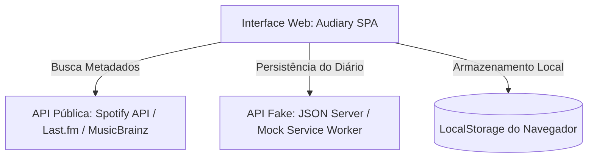

# Arquitetura de Software: Audiary

## 1. Contexto Técnico
Este documento detalha o design técnico da aplicação web Audiary. A aplicação operará como uma Single Page Application (SPA) baseada em consumo de dados de terceiros e uma camada de mock local para simular um banco de dados relacional sem a necessidade de um backend em nuvem nesta fase.

## 2. Visão do Sistema (Diagrama de Componentes)



## 3. Pilha Tecnológica (Tech Stack)
* **Frontend Core:** HTML5, CSS3 e JavaScript (ES6+).
* **Componentização / Framework (Opcional):** React.js ou Vue.js para manipulação reativa do DOM e estado da aplicação.
* **Estilização:** CSS Custom Properties ou Tailwind CSS para uma interface moderna baseada em Grid e Flexbox com abordagem Mobile-First.
* **API de Música Pública:** [Spotify Web API](https://spotify.com "Spotify Developer Portal") ou [Last.fm API](https://last.fm "Last.fm API") para obter metadados (capas de álbuns, faixas, artistas).
* **API Fake/Mock:** [JSON-Server](https://github.com "JSON-Server GitHub") rodando localmente para simular rotas HTTP estruturadas (`/users`, `/reviews`, `/logs`).
* **Validação:** JavaScript Nativo (Constraint Validation API) aplicada em todos os formulários.

## 4. Estrutura de Dados (JSON / Entidades)

O banco de dados simulado (`db.json`) gerenciará as seguintes tabelas relacionais:

### `users`
```json
{
  "id": "user_10",
  "username": "vinicius_music",
  "email": "vinicius@audiary.com"
}
```

### `logs` (O diário de audição)
```json
{
  "id": "log_888",
  "user_id": "user_10",
  "album_id": "ext_id_404",
  "album_name": "Abbey Road",
  "artist_name": "The Beatles",
  "cover_url": "https://link-da-imagem.com",
  "listened_at": "2026-08-25",
  "rating": 5,
  "liked": true
}
```

### `reviews` (Resenhas independentes ou vinculadas)
```json
{
  "id": "rev_202",
  "user_id": "user_10",
  "album_id": "ext_id_404",
  "review_text": "Uma obra impecável do início ao fim. O lado B do vinil é histórico.",
  "created_at": "2026-08-25T18:00:00Z"
}
```

## 5. Decisões Arquiteturais (ADRs)

* **Uso de uma API Fake + Armazenamento Local:**
  * **Justificativa:** Reduzir a fricção de infraestrutura no MVP. Permite que o foco do projeto se concentre puramente na lógica de front-end, design de interface responsivo e consumo assíncrono de APIs externas.
* **Uso de IDs Externos como Chave Estrangeira:**
  * **Justificativa:** Ao salvar um log ou review, o Audiary armazena o ID retornado pela API de música pública (`album_id`). Isso evita duplicar dados pesados de metadados no banco de dados fake.

## 6. Fluxo de Integração com a API Pública
1. O usuário digita um termo na barra de pesquisa do Audiary.
2. O front-end dispara uma requisição assíncrona (`fetch`/`axios`) para a API escolhida.
3. Os resultados retornados preenchem um grid de cards visuais.
4. Ao clicar no card, o ID do álbum é capturado e injetado nos formulários de Log e Review para persistência local.

